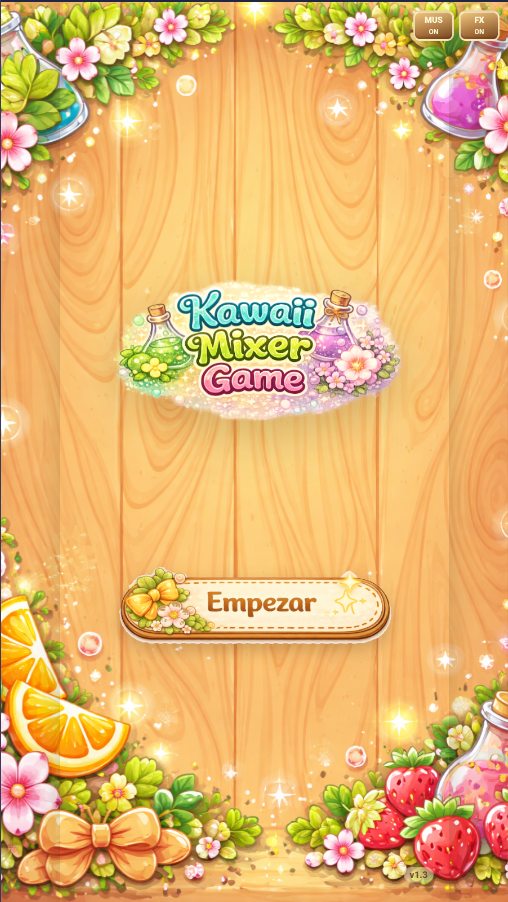
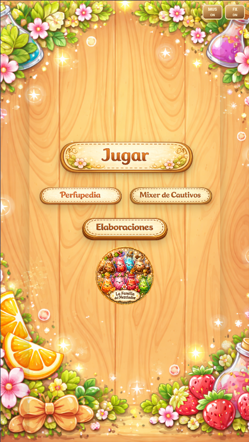
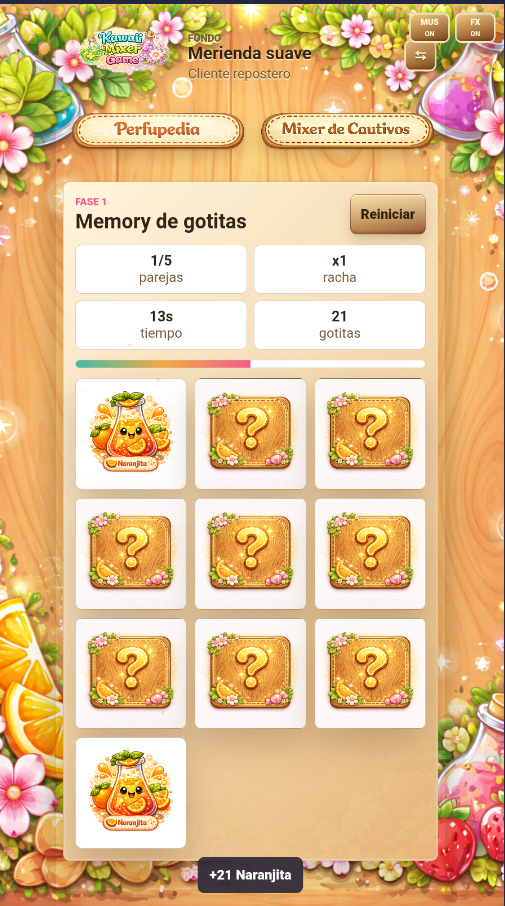
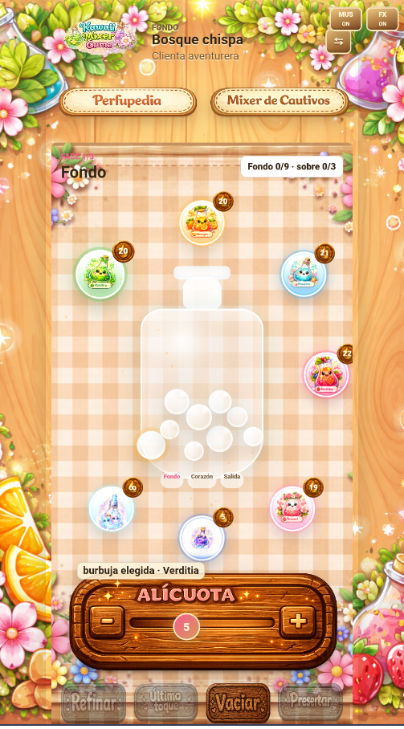

# Kawaii Mixer Game

Juego mobile-first de mezcla de perfumes con estética kawaii, memoria visual y progresión por pedidos. El jugador recoge gotas en un memory sencillo, combina Massnotas en el panel de juego y construye acordes olfativos por fases para responder al pedido de cada clienta.

> Estado: versión jugable en pre-release para pruebas privadas.

## Capturas

| Inicio | Menú |
| --- | --- |
|  |  |

| Memory | Mixer |
| --- | --- |
|  |  |

## Release actual

- Versión pública: `v1.5.0`
- Android corregido: `versionName 1.0.2`, `versionCode 3`
- Release: [GitHub Releases](https://github.com/Milothik/KMG/releases/tag/v1.0.0)
- APK recomendado para pruebas: `kawaii-mixer-game-debug.apk`

La build de Android ya incluye los archivos web empaquetados dentro de `android_asset/www`, los datos de niveles necesarios para el botón `Jugar` y el icono de la app. Si Android muestra "Aplicación no instalada" al actualizar desde una APK antigua, conviene desinstalar la versión previa y volver a instalar la APK de release.

## Qué incluye

- Pantalla inicial con botón `Jugar`, acceso a Perfupedia, Mixer de Cautivos y Elaboraciones.
- Loop principal de pedido, memory, panel de mezcla, lectura aromática y resultado.
- Tres fases de creación: `Fondo`, `Corazón` y `Salida`.
- Massnotas con notas aromáticas distintas, solvente y sistema Maggic.
- Memory táctil de gotas para conseguir materia prima antes de mezclar.
- Bubble Chart con lectura de acorde actual.
- Perfupedia persistente con progreso guardado en `localStorage`.
- Mixer de Cautivos con recetas ocultas y recompensas consumibles.
- Controles separados para música y efectos.
- Assets visuales integrados para interfaz, paneles, botones y fondo de juego.

## Ejecutar en local

```bash
npm start
```

Abre `http://localhost:5174` en el navegador. Para probarlo en móvil dentro de la misma red, usa la IP local del ordenador con el puerto `5174`.

También puedes generar el standalone:

```bash
npm run build
```

Después de la build puedes abrir `dist/kawaii-mixer-standalone.html`.

## Android

El proyecto Android se genera con Capacitor desde los archivos web del juego.

```powershell
.\android-wrapper\build-apk.ps1
```

Las APK finales de pruebas se guardan en la carpeta `ESTO ES LA APP`. La firma de release usa una keystore local privada, por lo que no se suben credenciales al repositorio.

## iOS

El repositorio incluye un workflow de Codemagic para generar una IPA sin firma comercial, pensada para pruebas con herramientas como Sideloadly. Para distribuir en App Store, TestFlight o instalar de forma oficial en iPhone hace falta una cuenta de Apple Developer y perfiles de firma válidos.

## Estructura principal

```text
index.html
css/styles.css
data/levels.json
js/assets.js
js/storage.js
js/colorMix.js
js/particles.js
js/systems.js
js/cautives.js
js/maggic.js
js/main.js
assets/images/
docs/screenshots/
docs/release/
android-wrapper/
build.js
server.js
```

## Notas de desarrollo

El juego está construido en HTML, CSS y JavaScript sin dependencias de runtime para el cliente. La app se empaqueta para Android con Capacitor y mantiene los datos jugables en archivos locales para que funcione sin servidor externo.
